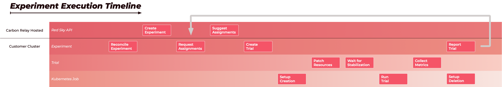

# Lifecycle

The experiment lifecycle consists largely of creating an experiment and iterating over trials, each operating within their own namespace on the cluster. The number of concurrently running trials is determined by the availability of namespaces to run trials in.

## Timeline

An experiment and its trials run in several steps, coordinated by the Red Sky Ops Controller: _(click to view larger)_

Note: If the Red Sky Ops Controller is not configured to use an API server, you can suggest trial configurations manually using `redskyctl suggest`. The Experiment process then starts with the _Create Trial_ step instead of _Reconcile Experiment_.

(`redskyctl suggest` can still be used with a server configured, but the suggestion will be sent to the server to be queued.)

## Experiment Creation

An experiment manifest is written and loaded into the cluster. When using the Enterprise product this will synchronize the cluster state with the remote Red Sky API server and begin requesting suggested parameter assignments; otherwise the system will be idle until suggestions are manually provided.

## Trial Creation

The definition of the experiment includes a trial template which will be combined with the parameter assignments to form a new trial resource in the cluster. Any failures during the remaining stages will cause the trial to marked as failed.

## Setup Creation

If the trial includes any setup tasks, a job is scheduled to run each setup task in individual containers. Setup tasks may incorporate parameter assignments, for example as a value in a Helm chart.

## Patch Resources

Using the patches from the experiment and the parameter assignments from the trial, an attempt is made to patch the cluster state. Empty patches are ignored, it may also be the case that parameter assignments established during setup tasks result in patch operations that do not result in changes.

## Wait for Stabilization

For any deployment, stateful set or daemon set that was patched, a rollout status check will be performed. Once the patched objects are ready the trial can progress.

## Run Trial Job

The trial resource includes a job template which will be used to schedule a new job. If container list of the job is empty, a container that performs a "sleep" will be injected (the amount of sleep time is determined by the `approximateRuntime` field on the trial). The start and completion times of the job are recorded on the trial (the recorded start time will be adjusted by the value of the `startTimeOffset` field on the trial).

## Collect Metrics

When the trial job completes, the metrics are collected according to their type. The metric values are recorded on the trial resource. For Prometheus metrics, a check is made to ensure a final scrape has been performed before metric collection. Once all metrics have been collected the trial is marked as finished.

## Report Trial

When using the Enterprise product, the metrics of finished trials are reported back to the remote Red Sky API server to improve the next round of suggested parameter assignments.

## Setup Deletion

If the trial included setup tasks, a job is scheduled to delete the objects created during setup creation.
