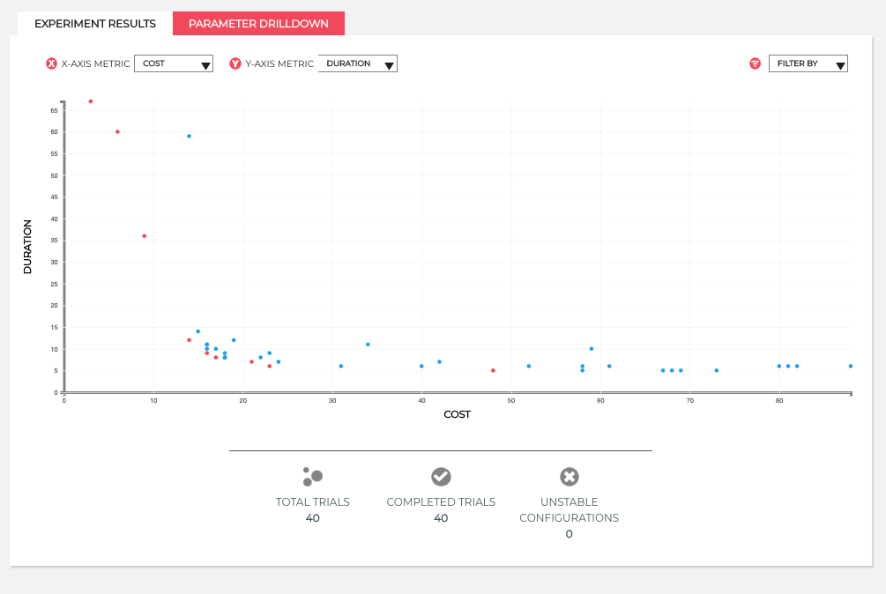

# Quick Start

The purpose of this guide is to get you started with Red Sky Ops.
In this example, you will use Red Sky Ops to tune the memory and cpu requirements for Postgres.
We will cover:
- Initializing Red Sky Ops in your cluster
- Deploying the Postgres experiment to your cluster
- Running trials using machine learning (ML) to determine the best configuration
- Comparing Red Sky Ops results to a baseline configuration

If you encounter any issues or require assistance, please reach out to us via [Slack][rso slack] or [contact us][contact us].

## Prerequisites

- Kubernetes cluster
  - A typical [minikube][minikube] cluster will be sufficient. The experiment may consume up to 4vcpu and 4GB memory
- [kubectl][kubectl] properly configured for your cluster
- [kustomize][kustomize] v3.1.0+
- [redskyctl][redskyctl]
- [Red Sky Ops Account][rso account]

## Initialize the Red Sky Ops Manager

After installing [redskyctl][redskyctl] and creating an [account][rso account], log in to your Red Sky Ops account:
```sh
$ redskyctl login
```

When you initialize your cluster for Red Sky Ops, the following resources will be created:
- `redsky-system` namespace
- `experiment` and `trial` custom resource definitions
- `ClusterRole` and `ClusterRoleBinding` for the controller service account
- `redsky-controller-manager` deployment
- an authorization secret for the controller

Initialize your cluster with the following command:

```sh
$ redskyctl init
```

Verify manager is running:

```sh
$ redskyctl check controller
```

## Create the Experiment

We're going to use the [Postgres example][postgres-example].
This example will deploy the Postgres application and configure an experiment to tune the memory and CPU limits for Postgres.
The controller will schedule trials (Kubernetes jobs) using `pgbench` to generate load against our Postgres instance.
Each trial will test a different set of parameters provided by the Red Sky Ops ML servers.
The effectiveness of each trial is gauged by the metrics, in this case we contrast cost versus duration.

Deploy the Postgres application and experiment using the following:
```sh
$ kustomize build github.com/redskyops/redskyops-recipes/postgres | \
  kubectl apply -f -
```

You can monitor the progress using `kubectl`:

```sh
$ kubectl get trials -o wide -w
```
You should see output similar to this:
```sh
NAME                        STATUS      ASSIGNMENTS             VALUES
postgres-example-000   Completed   cpu=1319, memory=1457   duration=7, cost=33
postgres-example-001   Completed   cpu=963, memory=2647    duration=5, cost=29
postgres-example-002   Completed   cpu=2394, memory=1934   duration=5, cost=58
postgres-example-003   Completed   cpu=3508, memory=2654   duration=6, cost=85
postgres-example-004   Completed   cpu=3410, memory=1019   duration=5, cost=78
postgres-example-005   Completed   cpu=2757, memory=2538   duration=4, cost=68
postgres-example-006   Completed   cpu=983, memory=3057    duration=6, cost=30
postgres-example-007   Completed   cpu=373, memory=3065    duration=15, cost=17
postgres-example-008   Waiting     cpu=1198, memory=2701
```

The trials will run until the `experimentBudget` is satisfied. In this example, there will be 40 trials that run.
While the trial is running, there may be assignment combinations that are unstable and result in a failure.
After the trial is complete, you will be able to view the parameters and the metrics generated from the trial.

## Add the Current Configuration as a Baseline

Optionally, you can compare Red Sky Ops results to a baseline by running a trial with the parameters that are currently set in the application manifests.
While your experiment is still running, use the following command to suggest a trial.

```sh
$ redskyctl suggest postgres-example --assign memory=4000 --assign cpu=4000 --labels 'baseline=true'
```

Alternatively, you can use `--interactive` which will prompt you to fill in integer values for each parameter in the experiment file. Set CPU=4000 and memory=4000.

```sh
$ redskyctl suggest postgres-example --interactive --labels 'baseline=true'
```

This will schedule a trial with the suggested parameters and collect duration and cost.
This trial will be counted towards the total number of trials allotted for the experiment.
When the experiment finishes, the baseline trial will be displayed as a triangle on the results page along with your experiment results.

## View the Results
The results can be reviewed as a visualization by running the following command:

```sh
$ redskyctl results
```

This should open a link in your browser showing a graph similar to the below.


This is where you can review the trials that have taken place and decide which parameter makes the most appropriate trade-off.
There is a filter on the upper right hand side where you can narrow your results to show only the `best` trials.
These are the trials with the best possible combination of cost and duration, meaning if you hold cost fixed at a given value, we have found the best possible duration.
You can choose any `best` configuration that works for your cost and duration preferences.
Often you find that since the metrics are not linearly related, there are some points that give a bigger boost in duration at a similar cost, so it is useful to explore all of the options to find the best one for you.
Once you have chosen an optimized configuration, click on the point to display the parameters to use in the application manifests.

Congratulations! You just ran your first experiment.
Now that you've got an idea of the basics, learn more about the experiment [lifecycle][lifecycle] or experiment [concepts][concepts].

## Remove the Experiment

To clean up the data from your experiment, simply delete the experiment. The delete will cascade to the associated trials and other Kubernetes objects:

```sh
$ kustomize build github.com/redskyops/redskyops-recipes/postgres | \
  kubectl delete -f -
```

[kubectl]: https://kubernetes.io/docs/tasks/tools/install-kubectl/
[kustomize]: https://github.com/kubernetes-sigs/kustomize/releases/
[minikube]: https://kubernetes.io/docs/setup/learning-environment/minikube/
[redskyctl]: install.md

[postgres-example]: https://github.com/redskyops/redskyops-recipes/tree/master/postgres
[rso account]: https://app.carbonrelay.io
[rso slack]: https://join.slack.com/t/redskyops/shared_invite/enQtODI2NzU5NDUxNTA2LWQ1MjlkY2FhNWI0NTE3OGEzOGI0MzMxZmExOGRlMDM0ODdjNWI4OTM5NWQxMDY0OWU2YzM0YTcyMjk1NmZhYWI
[contact us]: mailto:support@carbonrelay.com?subject=Help%20with%20Quick%20Start
[lifecycle]: lifecycle.md
[concepts]: overview.md#concepts
